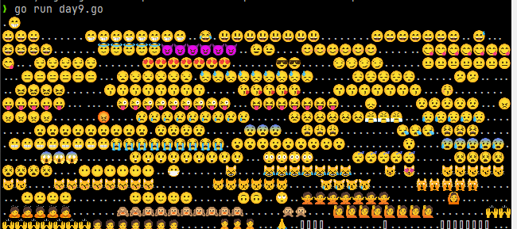

# Advent of Code 2024

My attempts at AOC 2024. I'm trying to use Go which so far is proving exceptionally frustrating...

Please don't treat this code as examples of good Go!

I'm also trying to use [Neovim](https://neovim.io) from my terminal without needing to touch my mouse. (I'm still having to use the mouse when I switch to the browser to read all the Go docs I need to learn how to solve the task).
To save having too much keyboard hand contortion I've enabled home row mods with [Kanata](https://github.com/jtroo/kanata). I was going to try switching my layout to [Colmak Mod-DH](https://colemakmods.github.io/mod-dh/) but honestly I've got enough problems.
## Day 1
No idea if I'm structuring things well for a Go project. Currently each day is a Go module and inside that there are folders for each star's task containing a file with the main method. I'm putting input files (but not committing) in the day folder and then calling with e.g.
```
go run day1-1/day1-1.go
```
Let's see if I refine this over time. It'd be nice to be able to pass in the input to be used rather than have to edit the source to use example input but I haven't figured out command line args yet!

## Day 2
I've done both solutions in the same file today. Just pass a `--dampener` switch to enable the "Problem Dampener". You can also now specify the file to read on the command line but it defaults to `input.txt`

It took me a while to get through the second part. I had a horrible unreadable mess of whether to skip characters which forced me into actually reading how to write functions in Go. It wasn't that hard! It'd be interesting to know whether I'm doing anything dangerous with copying arrays inside functions and then returning them. I haven't really got my head around slices yet. It feels like I should be able to have a slice that is backed by an array without me needing to copy it to have a slice without a specific element.

[Lazyvim](https://www.lazyvim.org) is proving to be pretty annoying. I'm comfortable with Vim motions and it's nice to have some hints as to invalid syntax Go from the LSP. However, it has a habit of inserting completions that I just don't want and the non text hints that are in your editor but not really in your source are pretty annoying. Since I don't know what plugins are causing these effects I'm thinking about using a more vanilla [kickstart.nvim](https://github.com/nvim-lua/kickstart.nvim) setup and knowing what I'm enabling. It'd be nice to have something to autosave like IntelliJ does.

## Day 3
Yay regex! Pt 2 took a bit longer because of needing to remember to add a multiline modifier. I should have twigged earlier since my first attempt at part 1 was processing the file line by line because I'd copied from previous days, until I realised that I needed to match on the entire content.

I tried kickstart.nvim but it removed too much. Hopefully given some more time I'll find a good middle ground. An annoyance that came up today is the different keyboard that I use in the office. It's a US keyboard that I have a UK layout mapped onto because I expect `"` to be above the `2` and `@` to be 2 to the left of `L` etc. (and I'm not looking at the keyboard to find them). However, it means I need to press `<Alt-Gr> \` to get a `\` and this for some reason (possibly a combination with Kanata) causes `<Ctrl>` to get locked on causing all sorts of weirdness until I realise and mash `<Ctrl>` to resolve it.

## Day 4
I found out that I don't really understand how Go slices are backed by arrays. I'm guessing the slice is passed by value but it's just a pointer to the actual data in the backing array. I got stuck on part 1 which worked fine on the test data but then failed on the real data. It turns out it is because the slices that I was adding to my grid data were backed by the bufio buffer used for reading from the file, so after reading beyond that buffer size it started changing what I could see in my grid data slices and returning the wrong XMAS count.

I thought I was doing it cleverly by checking rows, cols and diagonals for XMAS or SAMX. It worked fine but then wasn't at all useful for part 2 so they both operate differently.

## Day 5
I've learnt to use a struct to hold data. It still feels like I'm missing a lot of knowledge about the capabilities of Go. I should read a book sometime...

## Day 6
Part one was fun. I just brute forced part two by running the simulation until it went over a limit (gridSize\*gridSize). It ran quickly enough. It was easier to just copy paste part one and work differently than trying to do in the same file.

## Day 7
I had to read up on permutations again. Initially my function to generate the perms didn't work because I wasn't copying the slice each time. Seems I've still not got my head around how slices are backed by arrays. Gemini was able to point out my error though. It attempted to optimise it for me too but I didn't really understand the result so left as is. ≈15s to run part 2. I did wonder if the longer run time was because of all the conversion between int and string and back again but I tried out multiplying by 10 to the power of number of digits before adding the next operand and it made little difference. The longer time must be the increased number of permutations.
I've found out about the `range` keyword which made iterating over slices easier.

## Day 8
I used a Go map type to store the positions of the antennas and a struct to hold the coordinate data, that hopefully makes things more readable. I had ended up with a type definition of `map[byte][][2]int` which wasn't. It did lead me to search for conventions on naming of custom types in Go. I didn't really find anything conclusive.

I've tried to split up more into functions and it feels like some of these should be imported from a shared package(?) since I keep reusing them. I think that it helped me generalise the solution for part 2.

## Day 9
Ok, I gave up with Neovim... temporarily, at least for Go development. I can see how it will make editing easier and require less hand movement but it's slowing me down when I don't understand Go well enough either. I switched to VSCode because it much easier to set up the debugger (I clicked the install button).

I also found that in VSCode there is less type hinting that whilst nice to see some of the time, really clutters up what I'm looking at. I need to find out which plugin is causing that and tweak the options or turn it off.

Part 1 went quickly enough today but I got really stuck on part 2 because there was a bug in my code that only became apparent when using the real data. If the only available gap was just before the file being moved then it didn't move it. It was because in my defrag loop I was only finding available space up to, but not including the block before the first block of the file to be moved and this didn't happen in the test data.

Rendering the blocks was helpful with test data but once the blocks numbers went into the extended ASCII codes over 127 then I started getting unrenderable characters. I stopped using `byte`s to render and switched to `rune`s instead as well as adding `0x7F600` so that I got emojis. Not because it was useful but it created some fun output.



## Day 10
I had a basic comprehension failure on this task. I started with recursion, didn't work; tried iteratively with a queue (which I guess is DFS?), still didn't work. Saw some comments about people solving part 2 before part 1 and realised I was counting paths rather than unique 9s. It still didn't produce the right result. After some line by line debugging and much higher numbers than I expected I realised that I was checking all 8 directions rather than just North, East, South, West :facepalm:

At least when it came to part 2 there was only 20 or so characters to delete to remove the duplicate checking.

I'm using a Go slice for my queue and removing from the head by creating a new slice with the remainder. This might not perform that well but runs quickly enough for me. I don't know if there is any sort of linked list type so that I could remove the head more easily.

## Day 11
It was all so nice for part 1. I had an array of rules (funcs) that I could apply against the pebble (word) until I found one that matched and then update the line. I already had a parameter for the number of blinks so I just needed to run
```
go run . -blinks 75
```
for part 2.

5 minutes later I'm looking at the code thinking it can't possibly be in an infinite loop. 10 minutes after that the process crapped out.
```
❯ go run . -blinks 75
signal: killed
```
I suppose that could well be the OOM killer seeing the process using a lot of memory and not doing much?

I put some debug output on so that I could see the blink number and current length of line and reran to see the lines getting very long and progress very slow beyond blink 30. There was no way it was getting to 75!

I then realised that order doesn't really matter and refactored to use a map to store counts of each pebble rather than the full line. Initially I tried updating the map in place but obviously it ended up updating keys that hadn't been processed yet so when it came to update their count it was wrong. I then created a map of updates and applied that to the main map after each blink. Runs in <0.5s now! :watch: :hourglass:

## Day 12
Urgh... what a chore. Part 1 went ok. It would have been interesting if I'd committed checkpoints of my process rather than just the working end result. I started off not grouping into regions so was incorrectly counting non connected regions of the same plant. It now does 2 passes, one to group the regions and then one to count borders of the plots. It then looks to each region to total the plots' borders.

I really struggled with part 2. It's just not something that I've needed to think about before. I found a really helpful explanation of a way to solve it on [Reddit](https://www.reddit.com/r/adventofcode/comments/1hcdnk0/comment/m1nkmol/) but even that took me multiple attempts to really understand. There was also a lot of mixing up of x and dx and even transposing x and y values (I don't think having my grid as [y][x] is helpful!

## Day 13
I identified pretty quickly that I was finding the intersection of 2 lines. I used a [graphical calculator](https://www.desmos.com/calculator) to plot the examples and could see that I was looking intersections with whole values of x and y. I didn't fancy working out the maths myself so just did a search for [a formula to calculate the intersection](https://www.cuemath.com/geometry/intersection-of-two-lines/) and then checked the results to see if they were the same after having any fractional part truncated.

Amazingly part 2 was just a case of adding the offset to the prize coords and because I hadn't tried to brute force the answer it worked straight away.

## Day 14
Part 1 was fun. I don't think there's any optimal way to do this, you just have to get each bot to make its move and calculate the result afterwards. I have a struct `Bot` to represent a robot with its position and vector and maintain 2 slices to hold them in both a grid format and a list of robots so that I can iterate them more easily without having to visit each cell of the grid. It forced me to play with pointers as having a slice of robots on their own ended up with copies of them that weren't getting updated. Instead both slices point to a single `Bot` struct.

I gave each `Bot` an `id` attribute so that I could find them in the slice of `Bot`s at each grid cell using `slices.IndexFunc`

In part 2 I really didn't understand how I was going to solve it but reasoned that if they were going to line up to draw a Christmas tree then there must be a long line of horizontally aligned robots to form the bottom of the tree. I wrote a function to check for a line longer than `x` in a row, set `x` to 10 and iterations to 10000 and the tree popped out as if by magic. It turned out there is also a border around the tree so I could be detecting that instead.

Having written a function to output the grid in part 1 really helped to validate that it was the correct frame, however it took me 2 attempts to pass because I'd zero based the counter of iterations and the seconds started at 1.

```
1111111111111111111111111111111
1.............................1
1.............................1
1.............................1
1.............................1
1..............1..............1
1.............111.............1
1............11111............1
1...........1111111...........1
1..........111111111..........1
1............11111............1
1...........1111111...........1
1..........111111111..........1
1.........11111111111.........1
1........1111111111111........1
1..........111111111..........1
1.........11111111111.........1
1........1111111111111........1
1.......111111111111111.......1
1......11111111111111111......1
1........1111111111111........1
1.......111111111111111.......1
1......11111111111111111......1
1.....1111111111111111111.....1
1....111111111111111111111....1
1.............111.............1
1.............111.............1
1.............111.............1
1.............................1
1.............................1
1.............................1
1.............................1
1111111111111111111111111111111
```

ADDENDUM: I don't know why I thought that there isn't an easier way to do part 1. I realised later that each bot moves linearly so you could just multiple the vector by the number of iterations and just find the modulus of the width or height as required. However that would have made part 2 harder with the way that I looked for the tree so I'm glad I didn't realise this!

## Day 15
Ok, so this is what, in my head, the robots were doing in part 14.

Again, part 1 was fun and relatively uncomplicated. If the cell to moved into is empty, just move there. If it's got a box in it then keep looking for a space in the same direction until you hit a wall at which point you give up. Then move back in the opposite direction moving boxes into that space until you return to the robot which also gets moved into the space made by the final box.

Part 2 was more complicated but basically the same. Reading the grid needed a small change to double up cells in the x axis and then when processing the moves it was the same for left/right moves but when looking up down it had to check multiple cells. It uses a slice as a stack of cells so the first row is the left and right of a box which then looks to the next row in same direction to see how many boxes are hit which might be 0, 1 or 2, then 0, 1, 2, 3 or 4 and so on. As soon as it finds something that it can't move into (not an empty space or box) i.e. a wall then it gives up. Once it stops finding boxes and it's just empty space in the row above then it moves back down the built up boxes moving them all into the spaces that become available.

I had a bit of a play with rendering as an animation in the terminal. There are a couple of commented lines to clear the terminal with an ANSI escape sequence before each frame and to sleep at the end of rendering that frame to try and reduce flicker. It doesn't work on the main input (without a long delay) and I'd need to look more at only updating the parts that have changed rathern than the entire screen.

https://github.com/user-attachments/assets/d36b2fe6-8f5f-4279-82f5-25fff2fd3ac3

# Day 16
Another long one. I had to do some reading up on maze solving and Dijkistra's shortest path algorithm. I started off thinking that it was much more complicated because the cost of a path was affected by the entry point to the node because that affected the number of turns. I then realised that the cost of 1000 per turn so outweighed the cost per grid square travelled that I just needed to find the shortest paths in terms of nodes.

My initial commit for part 1 was (I think) a breadth first solution. I started by copying my now standard code for reading a grid from a file and printing it (I know I keep saying it but I really should look at shared modules!). Then I wrote a function to follow all paths to find the junctions, i.e. a point where the path needed to turn and would incur a 1000 point cost. Once I had that I followed paths from the start until I got to the end and didn't visit any node twice (but without checking if it was a cheaper route). This gave me costs at each node and I walked backwards from end to start always following the cheapest node. It worked... intermittently. I would get different results on different runs, I think because iteration of a map in Go isn't consistent and I was storing visited nodes and their costs in a map.

It was enough for me to get a correct answer to submit part one, but then in part 2 it wasn't good enough and I was forced to fix it to find all routes from start to end. I started off trying to keep the paths in an slice of slices of nodes but it confusing quickly so I switched to a struct for a node that held a pointer to the previous node in its path. It worked for the test grids but crapped out after 5 minutes with `signal: killed` which when I looked at `dmesg` was shown to be the OOM killer. I understood that my path finder was trying to find all paths start to end and that I needed to discard ones that I didn't want but my initial attempt at logging visited paths wasn't taking cost into account. It was after midnight, so I went to bed and realised I needed to check if the costs of the current path was higher than any previous cost for that node and just stop processing at that point.

# Day 17
When working in a language that doesn't have a built in for `pow(2, x)` and you need to roll your own, don't forget the 2^0 = 1! My initial function didn't do this and returned 2^0=2. The test data didn't run into this problem. Other than banging my head against that problem, part 1 was relatively simple.

Part 2 I've just cribbed from [Jamie](https://github.com/jamiebartlett-kps/AdventOfCode/blob/main/2024/Day17_2.mjs) and it has left me feeling a bit dirty :disappointed: :shit:

# Day 18
Part 1: The theory is that it should have just been a copy paste of day 16. I think my algorithm there wasn't optimal because it found all paths rather than attempting to get nearer to the goal. I re-read information on the [A*Star](https://matteo-tosato7.medium.com/exploring-the-depths-solving-mazes-with-a-search-algorithm-c15253104899) [algorithm](https://www.geeksforgeeks.org/a-search-algorithm/) and successfuly implemented it.

Part 2: I changed to read the whole file so that I could then pass a different slice in to build the grid and then used binary search until it found the point at which it wasn't possible to solve.

ADDENDUM: I've added vis/day18.go to visualise the path finding. It doesn't look very optimal! I appear to filling the entire grid rather than going straight towards the goal. Probably not A* then.

# Day 19
Phew, almost like a nice break. Very similar to day 7 but I was aware of memoization going into this time. Initially implemented part 1 to just return as soon as possible match was found but it was trivial to convert to accumulating all matches and then just check if greater than 0 for part 1 or sum for part 2.

# Day 20
I initially solved part 1 by using my maze solving from day 18 (which may or may not be A*, I'm not sure I really know). I then found all walls with less than 3 neighbours (i.e. removing them would introduce a new possible route) and brute forced the path finding for each of these.  It solved the test grid easily enough but barfed on the real input. So I threw processing power at it and learnt a bit about goroutines, channels, mutexes and wait groups. It still took quite a while and my laptop wasn't very responsive whilst it was running but it did come out with correct result. You can see that in my commit history.

I then had to do some reading for part 2 and saw that there is only 1 path and it doesn't need fancy path finding algorithms, it just needs to know the cost from each cell, working backwards from end to start. That gives you a path and from each point on that path you can calculate cells that can be reached within the cheat time using a manhattan distance, i.e. if you have a cheat of 20 picoseconds then you could reach a cell 20 north, or 10 west and 10 south or 7 east and 13 north etc. Finding all of these and then comparing them against the cost of the cell using the default path to see if the difference is less than then threshold. If it is it's a valid cheat. It was important to realise that the cheat doesn't need to be going through walls for all of its duration, just calculate all cells that could be reached in that time and don't finish in a wall.

# Day 21
I failed. I started trying to follow paths but then thought that it shouldn't matter because it's the same distance to go 2 up and 2 across as to go up,across,up,across and I'm pretty sure the bit about the non-button area crashing robots is a red herring. I started to think that I could just sort the key presses by the most expensive (right button) first but it's not coming out with the correct answer. Maybe you do need to generate all paths and find the actual shortest.
